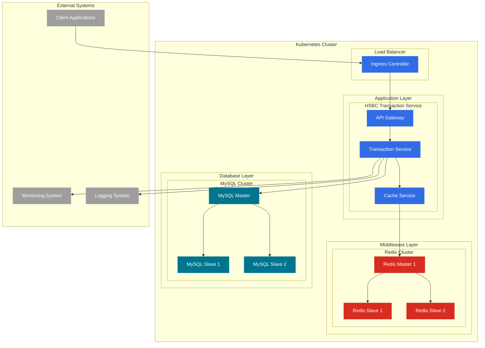

# HSBC Transaction Service

实时余额计算系统，提供安全、可靠的交易处理服务。

## 系统架构



## 架构说明

### 1. Kubernetes 集群层
- Ingress Controller：处理外部流量路由
- 服务部署在多个 Pod 中，确保高可用性
- 使用 ConfigMap 和 Secret 管理配置

### 2. 应用服务层
- API Gateway：处理请求路由和认证
- Transaction Service：核心业务逻辑
- Cache Service：缓存管理

### 3. 中间件层（Redis）
- 主从架构
- 用于：
  - 分布式锁
  - 缓存
  - 会话管理

### 4. 数据库层（MySQL）
- 主从架构
- 用于：
  - 交易数据持久化
  - 账户信息存储
  - 交易历史记录

### 5. 外部系统
- 客户端应用
- 监控系统
- 日志系统

## 关键特性

### 1. 高可用性
- 服务多副本部署
- 数据库主从复制
- Redis 集群

### 2. 可扩展性
- 水平扩展服务实例
- 读写分离
- 缓存分层

### 3. 安全性
- Kubernetes Secret 管理敏感信息
- 服务间 TLS 加密
- 访问控制

### 4. 监控和日志
- 集中式日志收集
- 性能监控
- 告警系统

### 5. 数据一致性
- 分布式锁
- 事务管理
- 缓存同步

## 技术栈

- **后端框架**: Spring Boot 2.7.x
- **数据库**: MySQL 8.0
- **缓存**: Redis
- **容器化**: Docker
- **编排**: Kubernetes
- **构建工具**: Maven
- **测试框架**: JUnit 5, TestContainers

## 快速开始

### 环境要求
- JDK 1.8+
- Maven 3.6+
- Docker
- Kubernetes 集群
- Redis 集群
- MySQL 集群

### 本地开发
1. 克隆项目
```bash
git clone https://github.com/feikiss/balance_calculator.git
```

2. 配置开发环境
```bash
cp src/main/resources/application.yml.example src/main/resources/application.yml
# 编辑 application.yml 配置数据库和Redis连接信息
```

3. 运行项目
```bash
mvn spring-boot:run
```

### 部署到 Kubernetes
1. 构建 Docker 镜像
```bash
mvn clean package
docker build -t hsbchomework:latest .
```

2. 部署到 Kubernetes
```bash
kubectl apply -f k8s/
```

## API 接口

### 账户管理接口

#### 创建账户
```http
POST /api/accounts
Content-Type: application/json

{
    "accountNumber": "ACC-001",
    "accountName": "测试账户",
    "initialBalance": 1000.00,
    "currency": "CNY"
}
```

#### 查询账户
```http
GET /api/accounts/{accountNumber}
```

#### 更新账户余额
```http
PUT /api/accounts/{accountNumber}/balance
Content-Type: application/json

{
    "balance": 2000.00
}
```

### 交易管理接口

#### 创建交易
```http
POST /api/transactions
Content-Type: application/json

{
    "transactionId": "TXN-001",
    "sourceAccountNumber": "ACC-001",
    "targetAccountNumber": "ACC-002",
    "amount": 100.00,
    "currency": "CNY",
    "description": "转账"
}
```

#### 处理交易
```http
POST /api/transactions/{transactionId}/process
```

#### 查询交易
```http
GET /api/transactions/{transactionId}
```

#### 查询账户交易历史
```http
GET /api/transactions/account/{accountNumber}
```

#### 分页查询交易
```http
GET /api/transactions?page=0&size=10
```

### 响应格式

所有接口返回统一的响应格式：

```json
{
    "code": 200,
    "message": "success",
    "data": {
        // 具体业务数据
    }
}
```

### 错误码说明

| 错误码 | 说明 |
|--------|------|
| 200 | 成功 |
| 400 | 请求参数错误 |
| 401 | 未授权 |
| 403 | 禁止访问 |
| 404 | 资源不存在 |
| 409 | 资源冲突 |
| 500 | 服务器内部错误 |

## 测试

### 运行单元测试
```bash
mvn clean test
```
#### 单元测试结果

其中，核心业务测试覆盖率80%左右

### jmeter性能测试
jmeter脚本地址：
```shell
/scripts/jmeter/balance-calculator-test.jmx
```
执行脚本：
```shell
sh scripts/jmeter/generate-performance-report.sh
```
####性能测试结果


### Resilience test
可靠性测试模型了数据库断连，缓存不可用，高并发，模拟服务不可用等场景，验证了代码的健壮性。
测试结果：


## 监控

系统集成了以下监控指标：
- 服务健康状态
- 交易处理延迟
- 缓存命中率
- 数据库性能
- 系统资源使用情况


## 许可证

本项目采用 MIT 许可证 