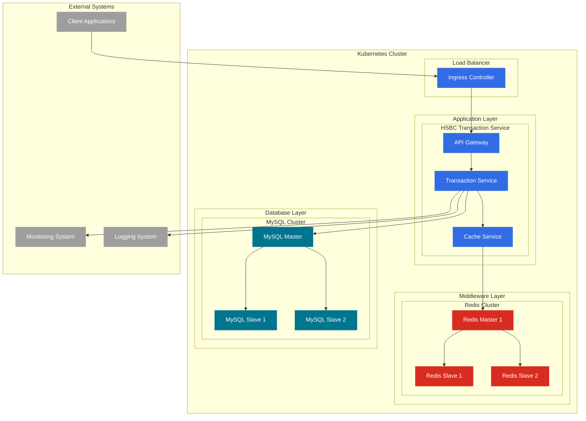

# Transaction System

Real-time balance calculation system providing secure and reliable transaction processing services.

## System Architecture



## Architecture Explanation

### 1. Kubernetes Cluster Layer
- Services are deployed across multiple Pods to ensure high availability.
- Uses ConfigMaps and Secrets for configuration management.

### 2. Application Service Layer
- API Gateway: Manages request routing and authentication (not integrated in this example).
- Transaction Service: Core business logic.
- Cache Service: Cache management.

### 3. Middleware Layer (Redis)
- Master-Slave architecture.
- Used for:
  - Distributed locks
  - Caching
  - Session management

### 4. Database Layer (MySQL)
- Master-Slave architecture.
- Used for:
  - Persisting transaction data
  - Storing account information
  - Keeping transaction history

### 5. External Systems (Dependencies not integrated)
- Client applications
- Monitoring system
- Logging system

## Key Features

### 1. High Availability
- Multi-replica deployment of services.
- Database master-slave replication (external dependency).
- Redis cluster (external dependency).

### 2. Scalability
- Horizontal scaling of service instances.
- Read-write separation.
- Tiered caching.

### 3. Security
- Sensitive information managed via Kubernetes Secrets.

### 4. Monitoring and Logging (Dependencies not integrated)
- Centralized log collection.
- Performance monitoring.
- Alerting system.

### 5. Data Consistency
- Distributed locks.
- Transaction management.
- Cache synchronization.

## Technology Stack

- **Backend Framework**: Spring Boot 2.7.x
- **Database**: MySQL 8.0
- **Caching**: Redis
- **Containerization**: Docker
- **Orchestration**: Kubernetes
- **Build Tool**: Maven
- **Testing Framework**: JUnit 5, TestContainers

## Quick Start

### Environment Requirements
- JDK 1.8+
- Maven 3.6+
- Docker
- Kubernetes
- Redis
- MySQL cluster

### Local Development
1. Clone the project
```bash
git clone https://github.com/feikiss/balance_calculator.git
```

2. Configure development environment
```bash
cp src/main/resources/application.yml.example src/main/resources/application.yml
# Edit application.yml to configure database and Redis connection details
```

3. Run the project
```bash
mvn spring-boot:run
```

### Deployment to Kubernetes
1. Build Docker image
```bash
mvn clean package
docker build -t hsbchomework:latest .
```

2. Deploy to Kubernetes
```bash
kubectl apply -f k8s/
```

## API Endpoints

### Account Management Endpoints

#### Create Account
```http
POST /api/accounts
Content-Type: application/json

{
    "accountNumber": "ACC-001",
    "accountName": "Test Account",
    "initialBalance": 1000.00,
    "currency": "CNY"
}
```

#### Query Account
```http
GET /api/accounts/{accountNumber}
```

#### Update Account Balance
```http
PUT /api/accounts/{accountNumber}/balance
Content-Type: application/json

{
    "balance": 2000.00
}
```

### Transaction Management Endpoints

#### Create Transaction
```http
POST /api/transactions
Content-Type: application/json

{
    "transactionId": "TXN-001",
    "sourceAccountNumber": "ACC-001",
    "targetAccountNumber": "ACC-002",
    "amount": 100.00,
    "currency": "CNY",
    "description": "Transfer"
}
```

#### Process Transaction
```http
POST /api/transactions/{transactionId}/process
```

#### Query Transaction
```http
GET /api/transactions/{transactionId}
```

#### Query Account Transaction History
```http
GET /api/transactions/account/{accountNumber}
```

#### Paginated Query Transactions
```http
GET /api/transactions?page=0&size=10
```

### Response Format

All endpoints return a unified response format:

```json
{
    "code": 200,
    "message": "success",
    "data": {
        
    }
}
```

### Error Code Explanation

| Error Code | Description |
|------------|-------------|
| 200 | Success |
| 400 | Bad Request |
| 401 | Unauthorized |
| 403 | Forbidden |
| 404 | Not Found |
| 409 | Conflict |
| 500 | Internal Server Error |

## Testing

### Running Unit Tests
```bash
mvn clean test
```
#### Unit Test Results
[](/screenshots/ut-coverage.png)
The core business test coverage is around 80%.

### JMeter Performance Testing
JMeter script location:
```shell
/scripts/jmeter/balance-calculator-test.jmx
```
Execute script:
```shell
sh scripts/jmeter/generate-performance-report.sh
```
#### Performance Test Results
[](/screenshots/jmeter-result.png)
[](/screenshots/jmeter-statics.png)

### Resilience Test
Resilience testing models scenarios such as database disconnection, cache unavailability, high concurrency, and simulated service outages to verify code robustness.
Test results:
[](/screenshots/resiliencetest.png)

## Monitoring

The system can integrate the following monitoring metrics (not integrated):
- Service health status
- Transaction processing delay
- Cache hit rate
- Database performance
- System resource usage